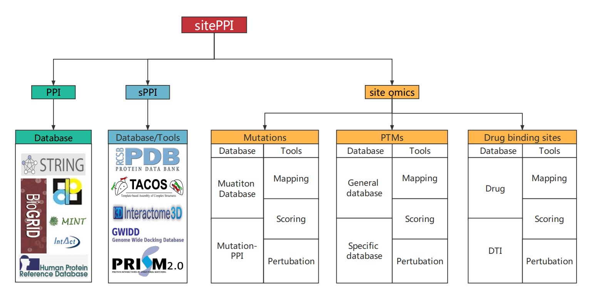

--- 
title: "sitePPI"
date: "`r Sys.Date()`"
site: bookdown::bookdown_site
documentclass: book
bibliography: [book.bib, packages.bib]
# url: your book url like https://bookdown.org/yihui/bookdown
# cover-image: path to the social sharing image like images/cover.jpg
description: |
  This is a template
link-citations: yes
github-repo: CSB-SUDA/sitePPI
---

# About{-}

## Main content{-}  

  